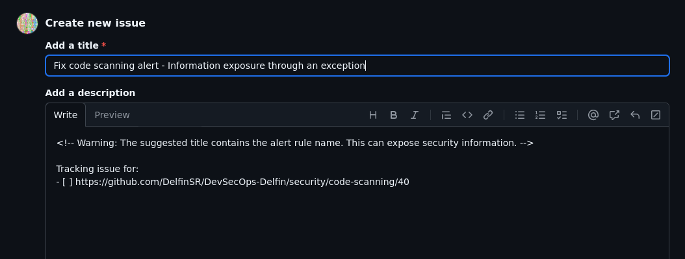

# DevSecOps - Delfín Santana

# Explicación del trabajo
### Resumen
En este trabajo se quiere definir el término DevSecOps, hacer una investigación sobre algunas de las herramientas que se utilizan actualmente y una implementación práctica. El repositorio de la implementación es [este](https://github.com/DelfinSR/DevSecOps-Delfin). Además, durante el desarrollo del trabajo, aunque no se planteara en un primer momento, se ha implementado una nueva funcionalidad a la herramienta rosemary cli.

### Resultados obtenidos
Resultados:
- Se ha generado esta memoria.
- Se ha creado el repositorio [DevSecOps-Delfin](https://github.com/DelfinSR/DevSecOps-Delfin) con la implementación. **Hay que tener en cuenta que la sección de security es privada para los miembros del repositorio por lo que hay cosas que solo se pueden ver mediante las capturas de este documento**
- Se ha añadido una funcionalidad a rosemary cli, que se encuentra en la rama [rosemary-functionality-detect-secrets](https://github.com/DelfinSR/DevSecOps-Delfin/tree/rosemary-functionality-detect-secrets) de ese mismo repositorio.

### Tareas realizadas
Tareas:
- Se ha hecho un estudio previo en el que se ha investigado qué es DevSecOps y qué herramientas se pueden utilizar.
- Se han probado dichas herramientas en un [repositorio de pruebas](https://github.com/DelfinSR/uvlhub_practicas), que **no** es el que se ha entregado pero si se quiere se puede mirar.
    - Durante las pruebas se ha decidido hacer la implementación de la funcionalidad a rosemary cli.
- Se han recogido los resultados en este documento. 

### Obstáculos
Aquí se listan los obstáculos encontrados:
- Solo se puede hacer un fork a un repositorio de GitHub
- Algunos de los workflows implementados tardan demasiado tiempo en ejecutarse(de esto se habla más en la conclusión)
- Cuando estaba probando diferentes herramientas de seguridad me dí cuenta de que corría el riesgo de terminar usando muchas herramientas que no estén integradas con el entorno de desarrollo original de uvlhub. Esta es una de las razones por las que implementé la funcionalidad a rosemary cli.

### Conclusiones y posibles trabajos futuros
Se habla más en detalle en la sección de conclusión.


# Definición
Según [IBM](https://www.ibm.com/think/topics/devsecops), [DevSecOps](https://www.ibm.com/think/topics/devsecops) (Development Security and Operations) es la práctica de automatizar la integración de medidas de seguridad en cada fase del proceso de desarrollo de software. Es decir, ya no solo se habla de automatizar las pruebas y la integración, sino que ahora también se quiere automatizar la seguridad.

Tal y como se explica en un [artículo de RedHat](https://www.redhat.com/en/topics/devops/what-is-devsecops), antes de DevSecOps(o los equipos que no lo utilicen) la seguridad se abarcaba al final del desarrollo por un equipo especializado. Actualmente, con los ciclos cortos que ofrece el DevOps, para sacarle todo el partido a la práctica se debe de hacer de la seguridad una responsabilidad compartida por el equipo. Esto no quiere decir que el DevSecOps sea simplemente añadir GitHub Actions que hagan análisis de seguridad, sino que se debe de pensar en la seguridad como un proceso importante en todas las fases, desde el inicio.

## ¿Está justificado el uso de un nuevo término para referirse a esta práctica?
A mi parecer sí está justificado, ya que actualmente vivimos en un momento en el que se debe de fomentar la seguridad. Sin embargo, no considero que sea solo un añadido al DevOps, ya que plantea un cambio significativo en la mentalidad y el desarrollo. Por ejemplo, si se aplica thread modeling se puede dar el caso de que cambie completamente el desarrollo de la aplicación si se detectan puntos muy inseguros.

# Análisis de herramientas
Para hacer esta sección me he basado en gran parte en la guía de [DevSecOps de OWASP](https://owasp.org/www-project-devsecops-guideline/latest/). 

**Threat Modeling**: Tal y como se explica en la [sección de OWASP](https://owasp.org/www-project-devsecops-guideline/latest/00b-Threat-modeling), el threat modeling trata de ofrecer un análisis de los potenciales ataques y riesgos que puede sufrir una aplicación. Plantea diferentes metodologías, como [STRIDE(Spoofing, Tampering, Repudiation, Information disclosure, Denial of service, Elevation of privilege) o PASTA(Process, Attack, Simulation, Threat, Analysis)](https://versprite.com/blog/what-is-pasta-threat-modeling/). Se debe de analizar la aplicación siguiendo estas metodologías para así entender como podrían atacarnos o donde implementar medidas de seguridad.


**Pre-commit**: Es importante implementar medidas de seguridad en el lado del desarrollador. Esto puede evitar que se añadan vulnerabilidades o información sensible al código desde un primer momento.
- **IDE**: En [este vídeo](https://www.youtube.com/watch?v=PewAQZzdvlA) se puede ver un análisis de distintas herramientas que se pueden añadir a Visual Studio Code:
    - Se muestra el add on de .env que permite ocultar y manejar información sensible en los .env
    - Se muestra también la extensión con gestores de contraseña, como 1Password, que te permiten guardar los secretos en el gestor e integrarlo en el proyecto mediante referencias.
    - También permite la implementación de **la herramienta [Snyk](https://snyk.io/)**, herramienta que te permite hacer análisis de vulnerabilidades del código. Hablaremos de esta herramienta más adelante.
    - El Add On Dependency Analytics, como su propio nombre indica, realiza un análisis de las dependencias del código. Esta funciona gracias a Snyk.
    - También muestra la implementación de SonarLint, que se debe de conectar con SonarCloud o SonarQube para que analice los posibles fallos de seguridad.

- **Herramientas de manejo de secretos**: El manejo de secretos es clave. De filtrarse las contraseñas de acceso o api keys, estas podrían usarse para realizar acciones no autorizadas. Se entiende que nadie filtra este tipo de secretos voluntariamente. Por este motivo se deben de implementar herramientas que analicen automáticamente en busca de filtraciones. Sin embargo, idealmente estos análisis se deben de hacer en local, para que el secreto no llegue a salir del ordenador del desarrollador. 
    - En la página de [OWASP sobre esta sección](https://owasp.org/www-project-devsecops-guideline/latest/01a-Secrets-Management) podemos encontrar distintas sugerencias de herramientas(esta información ha sido recabada a finales de enero-principios de febrero de 2025).
        - **[gittyleaks](https://github.com/kootenpv/gittyleaks)**: El último commit fue hace 5 años
        - **[git-secrets](https://github.com/awslabs/git-secrets)**: El último commit fue hace 2 años. Aunque parece estar mantenida por awslabs, en un rápido análisis parece que no siguen atendiendo las Issues y Pull Requests.
        - **[repo-supervisor](https://github.com/auth0/repo-supervisor)**: Github nos indica que el repositorio ha sido archivado. Además, el README.md pone que el repositorio no está siendo mantenido.
        - **[trufflehog](https://github.com/trufflesecurity/trufflehog)**: Esta herramienta sí está siendo activamente mantenida, pero parece que está más orientada al análisis de repositorios ya publicados. Lo que yo busco es una herramienta que haga el análisis localmente.
        - **[git-hound](https://github.com/ezekg/git-hound)**: El último commit fue hace 5 años. Además, está escrita en golang, lo que dificulta la integración con el proyecto de uvlhub.
    - **Búsqueda propia:**
        - **[detect-secrets](https://github.com/Yelp/detect-secrets)**: 
            - Esta herramienta permite detectar secretos en el código local y gestionarlos para así detectar falsos positivos. 
            - La gestión de los falsos positivos la hace con el archivo baseline(no tiene por qué llamarse así), que como su propio nombre indica plantea una línea base de los secretos que deben de ignorarse o son falsos positivos. 
            - Para indicar los falsos positivos debemos de correr el parámetro audit. 
            - Por otro lado, esta tiene integrado la funcionalidad detect-secrets-hook, que parece estar pensada para utilizarse en los hooks de la herramienta que utilices. Sin embargo, no conseguía configurarlo correctamente, por lo que decidí implementar la funcionalidad de detectar secretos a la herramienta Rosemary CLI a partir de la librería de detect-secrets. De este modo, conseguí también construir un hook de git que no te deja hacer commit a no ser que tengas correctamente manejados los secretos(se analicen los secretos y se determinen los falsos positivos). Más adelante se hablará más en detenimiento sobre la nueva funcionalidad de rosemary.
        ```bash
        #!/bin/bash
        rosemary detect_secrets --all_files --baseline > /dev/null

        if [ $? -eq 1 ]
        then
            echo "You can't commit yet. You may be leaking secrets...run 'rosemary detect_secrets --all_files --add_to_baseline' before continuing"
            exit 1
        fi
        ```

**Análisis de código estático**: En análisis estático se refiere al análisis del código en búsqueda de evidencias de vulnerabilidades conocidas sin ejecutarlo. El código que se pretende subir al repositorio se debería de analizar de manera automática para así evitar introducir vulnerabilidades en el repositorio. Se busca encontrar una solución que funcione a través de los GitHub Actions para que así el análisis se haga automáticamente.
- GitHub proporciona una herramienta por defecto llamada **[CodeQL](https://codeql.github.com/)**. Esta analiza el código en búsqueda de vulnerabilidades y las muestra en la sección **Security** del repositorio. 
    - Que los resultados se muestren en una misma ventana del repositorio es una ventaja ya que así se puede revisar fácilmente sin tener que ir a un servicio externo. El tener que revisar un servicio externo puede poner a prueba la disciplina del equipo, lo que, dada la importancia de los análisis de seguridad puede resultar en catástrofe.
- En la [sección específica a este tipo de herramientas de la guía de OWASP](https://owasp.org/www-project-devsecops-guideline/latest/02a-Static-Application-Security-Testing) nos indican distintas herramientas que pueden hacer análisis estáticos. Hay algunas que son específicas para ciertos lenguajes de programación, y hay otras que son más generales. Entre estas se encuentran **SonarQube**, que no se ha querido integrar para no implementar un gran número de workflows.
- **Codacy**, herramienta que se da en la asignatura, tiene una sección para mostrar alertas de seguridad. 
    - Lo malo es que los fallos detectados no se ven en la sección de Security, sino que hay que meterse en la aplicación.
- **La herramienta [Snyk](https://snyk.io/)** permite hacer análisis estáticos, entre otros. 
    - De hecho, el propio GitHub ya ofrece una implementación de un GitHub Actions que utiliza esta herramienta. 
    - Además, en la [documentación de Snyk](https://docs.snyk.io/scm-ide-and-ci-cd-integrations/snyk-ci-cd-integrations/github-actions-for-snyk-setup-and-checking-for-vulnerabilities/snyk-python-action) también podemos encontrar varios GitHub actions para poder utilizarlo. 
    - Esta herramienta sí que permite subir los resultados a la sección de Security.

**Análisis dinámico**: Además de hacer análisis del código sin ejecutarlo, se debe de hacer análisis de la aplicación en funcionamiento. 
- En la [sección de la guía de OWASP](https://owasp.org/www-project-devsecops-guideline/latest/02b-Dynamic-Application-Security-Testing) podemos encontrar algunas herramientas. Sin embargo, solo dan una que sea open source: la herramienta de OWASP [ZAP](https://www.zaproxy.org/). Esta herramienta es muy famosa y utilizada dentro del ámbito de la ciberseguridad.
    - Para utilizar ZAP con GitHub Actions se puede utilizar [este actions del propio ZAP](https://github.com/zaproxy/action-full-scan). Sobre esto se hablará más adelante.
- Otra herramienta que hace análisis de seguridad automáticamente es [nikto](https://github.com/sullo/nikto) herramienta también famosa(aunque no listada en la página de OWASP). Sin embargo, se ha querido utilizar zap porque genera informes más gráficos y estilizados.

**Análisis interactivo**: Como se define en la [página de OWASP](https://owasp.org/www-project-devsecops-guideline/latest/02c-Interactive-Application-Security-Testing), se refiere al análisis que se hace automáticamente mientras se interacciona con la aplicación. Este se diferencia del análisis dinámico en que el análisis interactivo tiene acceso al código y puede ver los procesos internos mientras se ejecuta. Por otro lado, se diferencia del análisis estático en que en el estático no se puede ver la aplicación en funcionamiento. Las herramientas que propone la guía de OWASP parecen ser demasiado empresariales para este proyecto.

**Análisis de componentes**: Como su propio nombre indica, este tipo de análisis busca analizar las dependencias para comprobar la seguridad.
- GitHub tiene la herramienta [Dependabot](https://docs.github.com/es/code-security/getting-started/dependabot-quickstart-guide) que hace esta tarea. La ventaja clara de esta herramienta es que está integrada en la sección de Security de los repositorios de GitHub.
- En la [guía de OWASP](https://owasp.org/www-project-devsecops-guideline/latest/02d-Software-Composition-Analysis), podemos encontrar diferentes sugerencias. Estas son las que he encontrado más interesantes:
    - **[OWASP Dependency-Check](https://owasp.org/www-project-dependency-check/)**: herramienta de OWASP para analizar los componentes. Es compatible con Python y se puede integrar con GitHub Actions.
    - **[retire.js](https://github.com/RetireJS/retire.js)**: herramienta para analizar dependencias de Javascript y NodeJS. 
    - **[safety](https://github.com/pyupio/safety)**: herramienta diseñada para analizar las dependencias de una aplicación escrita en Python. Además, se presenta como una aplicación fácil de implementar con GitHub Actions.
    - **[Snyk](https://snyk.io/)**, herramienta que ya se ha mencionado anteriormente, también hace análisis de dependencias.

**Análisis de la infraestructura**: Tal y como se explica en la [sección de la guía de OWASP](https://owasp.org/www-project-devsecops-guideline/latest/02e-Infrastructure-Vulnerability-Scanning), no solo es importante analizar la aplicación que se está desarrollando, sino también el servidor en el que se despliega la aplicación. La guía muestra herramientas ampliamente conocidas en el ámbito de la ciberseguridad. Las que he encontrado más interesante son: 
- **[nikto](https://github.com/sullo/nikto)**, que ya ha sido nombrada anteriormente
- **La herramienta [nessus](https://www.tenable.com/products/nessus/nessus-professional)**, que una herramienta empresarial muy famosa en el sector.

**Análisis de contenedores**: Es importante no solo analizar el código sino también analizar el contenedor que va a contener la aplicación. 
- En la [sección de la guía de OWASP](https://owasp.org/www-project-devsecops-guideline/latest/02f-Container-Vulnerability-Scanning) se muestran algunas herramientas como son [Clair](https://github.com/quay/clair) o [Anchore](https://anchore.com/opensource/). Sin embargo, no las he analizado porque no voy a utilizar contenedores en mi implementación.
- **[Snyk](https://snyk.io/)**, herramienta que ya se ha mencionado anteriormente, también hace análisis de contenedores.


# Caso práctico

En esta sección se plantea hacer un caso práctico a partir del repositorio de [uvlhub](https://github.com/EGCETSII/uvlhub) que hemos estado utilizando para las clases prácticas.

## Thread modeling
Se pretende hacer un análisis preliminar de los posibles riesgos de seguridad que podría sufrir la aplicación. No he seguido ninguna metodología específica por falta de experiencia y tiempo. Siguiendo el [diagrama que se da en las prácticas](https://1984.lsi.us.es/wiki-egc/images/egc/c/ca/EGC_2024-25_P1.pdf) se pueden notar ciertos puntos que deben de atenderse.


- Se puede ver como existe un módulo de autenticación. En general, todos los inputs son peligrosos, pero los sistemas de Log In son puntos especialmente críticos dentro de la aplicación.
    - Se debe de dar especial atención a este módulo
- El módulo de fakenodo/zenodo se conecta a un servicio externo. Esto plantea ciertos problemas, como puede ser el [DNS Spoofing](https://www.ccn-cert.cni.es/publico/seriesCCN-STIC/series/400-Guias_Generales/401-glosario_abreviaturas/index.html?n=899.html)
- El módulo teams aparentemente no plantea demasiado riesgo, por lo que se deberá de revisar menos.

Esto es simplemente un ejemplo. Se debería también de analizar cuáles módulos pueden leer o escribir archivos en el servidor y tener acceso a la base de datos. 

## Estructura de ramas
Se plantea la siguiente estructura de ramas para hacer una demostración:
- **Rama main**: Rama principal lista para entregarse. En la rama main no deben de haber vulnerabilidades no contempladas o analizadas. Cuando se hace un push o una pull request a main se ejecutan workflows que, entre otras cosas, ejecutan los tests y despliega en render en la url [https://uvlhub-delsanrub.onrender.com](https://uvlhub-delsanrub.onrender.com). En algún momento daré de baja el servicio.
- **Rama develop**: Rama de desarrollo. En específico, en esta demostración de un workflow de DevSecOps, es el último momento en el que se deberían de analizar los problemas de seguridad. Se deberá de unir a main mediante pull request.
    - **Ramas features con nombre descriptivo**: Ramas para desarrollar alguna funcionalidad en específico. Cuando se complete la funcionalidad se deben de juntar a la rama develop mediante una Pull Request. En esta Pull Request se deben de pasar los workflows de seguridad.

## Configuración
Explicación de la configuración:
- **Codacy**: El workflow se instala de la misma manera que se explica en clase. Añadiendo los secrets.
- **Sección Security**: Como se puede ver, GitHub ya tiene opciones implementadas para poder implementar medidas de seguridad. Estas se encuentran en la sección de Security. 

    - Si le damos  a la sección de Code Scanning nos muestra como podemos configurar herramientas para hacer análisis de código automáticamente. 
    - Si le damos a configurar, nos saltará a la sección donde podemos empezar a configurar estas herramientas. Salta a la vista que hay una sección en la que da la opción a añadir *Reglas de Protección*. Estas reglas evitarían que, por ejemplo, se aceptase una pull request que tiene fallos de seguridad graves. De hecho estas reglas también se podrían usar para asegurar un deploy o cosas por el estilo. Sin embargo, en el workflow que he diseñado he preferido que sea el revisor el que tenga todo el control. 
    - En mi caso, he decidido elegir la opción de configurar manualmente yo el actions para cambiar los momentos en los que se ejecuta. Por defecto me salta que se ejecuta cuando se hacen push o prs a main, o cada cierto tiempo. La opción de que se ejecute cada cierto tiempo puede ser interesante, pero también puede ser redundante e incluso gastar todos los recursos que ofrece GitHub Actions gratuito. 
    - 

    - Por esto, en un primer momento lo modifiqué para que solo se ejecutase cuando se hacían prs o pushes a develop. Sin embargo, una vez probada esta configuración, también probé que se lanzase cuando se hacía un push o una pull request en cualquier rama. El resultado no arrojó mucha diferencia(además de que es un workflow que puede tardar).
- Además del workflow de CodeQL, he decidido implementar el workflow de Snyk, que también se encuentra entre los que ofrece GitHub. Sin embargo, en este sí que he hecho más modificaciones(eliminando, por ejemplo, que no se suba el análisis a la plataforma para evitar así que el equipo tenga que irse a otra plataforma para ver los resultados) y he añadido el workflow que viene en su [documentación]( https://docs.snyk.io/scm-ide-and-ci-cd-integrations/snyk-ci-cd-integrations/github-actions-for-snyk-setup-and-checking-for-vulnerabilities/snyk-python-action) (del que he hablado anteriormente) como un job más. Para usar snyk se tiene que hacer una cuenta y obtener un token para usarlo en el workflow(en account https://app.snyk.io/account).
    - Como con CodeQL, en un primer momento seleccionñe que solo se ejecutase cuando se hacían prs o pushes a develop y después lo cambié. Obtuve los mismos resultados.
- Para hacer un análisis dinámico he utilizado la herramienta de código abierto ZAP. He hecho un workflow [basándome en el que indiqué anteriormente](https://github.com/zaproxy/action-full-scan). Lo que he añadido es que el workflow ejecute uvlhub con docker para que la herramienta ZAP pueda analizar la versión de desarrollo. 
    - Este workflow lo configuré para que solo se ejecutase cuando se hacían prs o pushes a develop y no lo cambié porque tardaba demasiado tiempo.
    - No creo que fuese recomendable utilizar este workflow para que también analice periódicamente la versión de producción, porque:
        - Consume mucho tiempo.
        - No estaría bien mostrar a todos los visitantes del repositorio las vulnerabilidades que tiene la versión de producción. 
            - Esto se podría solucionar teniendo un repositorio privado y mejorando el plan. 
            - También se podría tener una máquina aparte que haga los análisis y no publique los resultados. 
    - El workflow implementado crea una issue con los resultados y también genera un zip con los resultados para que se pueda analizar correctamente. 
        - **Hay que tener en cuenta que como hace el análisis a localhost, siempre va a dar el falso positivo de que no se utiliza HTTPS**.
- Otra funcionalidad de GitHub que he añadido es la de revisar las dependencias con dependabot. En este caso solo he puesto que me notifique las alertas, aunque también hay opciones para que directamente te abra pull requests solucionando los errores.
    - He decidido no añadir otra herramienta de las listadas en la guía de OWASP porque sería redundante.

- He añadido un hook y una funcionalidad a rosemary para controlar los secretos a partir de la herramienta de Yelp **[detect-secrets](https://github.com/Yelp/detect-secrets)**:
    - He añadido el comando:
        -  **detect_secrets**: se utiliza: rosemary *detect_secrets*. Es el comando utilizado para buscar secretos. Lo que hace el código que he implementado es simplemente ejecutar la herramienta de Yelp por la línea de comandos con subprocess y tratar la respuesta para que sea más legible. He tomado esta decisión porque la herramienta de Yelp devuelve código json. Aquí se muestra una comparación entre el comando *detect-secrets scan*(comando original de Yelp) y el comando *rosemary detect_secrets*.
        
            - **--all_files**: Opción para escanear todos los archivos(y carpetas recursivamente) situados en la ruta indicada en la variable de entorno *WORKING_DIR*. También se le puede pasar como opción una ruta alternativa(le daría preferencia a la especificada). De nuevo, se muestra una captura mostrando el resultado de ejecutar este comando. Como se ve en la captura, esta vez sí que ha encontrado secretos porque ha analizado todos los archivos. La herramienta por defecto no te muestra en texto plano los secretos por seguridad(de nuevo, así es como trata los secretos la herramienta de Yelp). 
            - **--baseline**: Si se analiza la captura anterior, se puede ver como los secretos encontrados realmente son "falsos positivos". Por ejemplo, detecta secretos en el *.env* porque se especifican contraseñas para lanzar la aplicación para el proceso de desarrollo. Para solucionar esto, la herramienta de Yelp tiene la funcionalidad del **baseline**, que como ya he explicado antes, es un archivo que se utiliza para avisar a la herramienta de los falsos positivos. Si ejecutamos este comando nos avisará de que no existe archivo baseline. Veremos como se crea en el siguiente comando. Hay que tener en cuenta de que, una vez creado el baseline, si se usa esta opción el baseline se actualiza solo si se detectan nuevos secretos 
            - **--add_to_baseline**: crea el archivo *.secrets.baseline*, el baseline. He decidido que no se pueda cambiar el nombre mediante opciones por consola para fomentar la estandarización. Este comando en principio solo debería de ejecutarse una vez, ya que como he dicho anteriormente el baseline se actualiza solo si se pasa como parámetro(si se pone *--baseline*). Una vez creado el baseline, se debe de ejecutar el comándo *detect-secrets audit ./.secrets.baseline*(utilizando directamente la herramienta de Yelp) para descartar los falsos positivos. Por otro lado, si los secretos detectados no son falsos positivos, simplemente se debería de ir al archivo donde se han detectado y eliminarlos manualmente.
                - Si después ejecutar este comando volvemos a ejecutar *rosemary detect_secrets --all_files --baseline* y no hemos tratado antes los secretos con *detect-secrets audit ./.secrets.baseline* o borrándolos, nos saldrá lo siguiente:
                - Como vemos hay que ejecutar antes *detect-secrets audit ./.secrets.baseline* o eliminar los secretos. El comando *detect-secrets audit ./.secrets.baseline* se ve así: 
                - Una vez se contemplan todos los errores, si volvemos a ejecutar *rosemary detect_secrets --all_files --baseline* se vería así:
    - Hay que tener en cuenta que el archivo baseline *.secrets.baseline* es un archivo que puede ser propenso a filtrar información sensible. Por ejemplo, si por error se marca un secreto como falso positivo y se comparte el archivo baseline se estaría compartiendo información sensible. Sin embargo, en el archivo baseline no se encuentran los secretos en texto plano, sino hasheados.
    - Además, como ya he dicho antes, he creado también un hook pre-commit que utiliza esta funcionalidad. En el pre-commit que he hecho se analizan todos los archivos, pero se podría quitar el *--all_files* para que solo analizase los archivos tracked:
        ```bash
        #!/bin/bash
        rosemary detect_secrets --all_files --baseline > /dev/null

        if [ $? -eq 1 ]
        then
            echo "You can't commit yet. You may be leaking secrets...run 'rosemary detect_secrets --all_files --add_to_baseline' before continuing"
            exit 1
        fi
        ```

## Funcionamiento

Para probar el repositorio, he subido la funcionalidad añadida a rosemary en la rama *[rosemary-functionality-detect-secrets](https://github.com/DelfinSR/DevSecOps-Delfin/tree/rosemary-functionality-detect-secrets)* y he hecho y aceptado una pull request de esta rama a develop para ver cómo reaccionan los workflows. Además, he ido haciendo algunos cambios durante la marcha para ver cómo reaccionaba el repositorio al cambiar cuando se ejecutaban los actions y cosas por el estilo. Todo esto se puede ver en el historial de commits y de ejecuciones de actions.

Como se puede ver, cuando se hace una pull request se lanzan los GitHub Actions. En este caso el único que da error es el de Codacy. Sin embargo, he aceptado la pull request para que pueda pasar a develop.


Si nos vamos a codacy para ver los fallos de seguridad podemos ver los siguientes resultados.


Uno de los fallos de seguridad que Codacy marca como crítico es el siguiente:


Codacy nos advierte de algo que es cierto, que [la función hash md5 se considera insegura](https://en.wikipedia.org/wiki/MD5#Security). Sin embargo, dependiendo de cómo se utilice en la aplicación(si no se utiliza para una funcionalidad crítica por ejemplo) se podría considerar un falso positivo. Una forma de solucionar este fallo es sustituyendo md5 por sha2 o sha3.

Por otro lado, si vamos a la sección de seguridad y **filtramos por branch** podemos ver estos resultados entre otras cosas: 


Si analizamos el resultado #40, vemos lo siguiente:


Nos advierte que estamos enviando el contenido de una excepción. Esta podría contener información sensible. Sin embargo, si se tratase de un falso positivo podríamos simplemente darle al botón de *Dismiss alert*. Si queremos solucionarla deberíamos de darle a *Create Issue*(si es que queremos crearla). Sin embargo, hay que tener en cuenta que si creamos la issue y el repositorio es público y que esa issue será vista por todo el mundo. De esto mismo se nos advierte si le damos al botón de crear la issue.


Por otro lado, también se puede **filtrar por herramienta**. 


Si filtramos por la herramienta snyk podemos ver como el código de errores es diferente. Sin embargo si abrimos por ejemplo la alerta #17 podemos ver como la interfaz es la misma:


Si nos vamos a la sección de dependabot, vemos que nos saltan alertas por las dependencias. En la configuración podríamos activar la funcionalidad para que nos crease pull requests automáticas solucionando estos errores.


Por otro lado, respecto a la herramienta ZAP, podemos ver que nos crea una Issue con los resultados. Hay que tener en cuenta que estos resultados son públicos y accesibles por todo el mundo.


Al final de la issue nos incluye un link para descargar el report, que se puede descargar desde [aquí](https://github.com/DelfinSR/DevSecOps-Delfin/actions/runs/13134794028). Si lo descargamos y abrimos el archivo html obtendremos los resultados en un bonito formato. Sin embargo, a mi parecer hay algunos falsos positivos.


# Conclusiones

Estas son las conclusiones a las que he llegado tras desarrollar este trabajo:
- La gestión de la seguridad debe de estar lo más centralizada e integrada en el entorno de desarrollo posible. GitHub te permite conseguir esto.
- Estas herramientas se deben de gestionar correctamente para que no terminen tardando demasiado. Por ejemplo, el workflow de ZAP puede llegar a tardar bastante.
- El DevSecOps es una práctica que puede solucionar problemas de seguridad mucho antes de que lleguen a producción.
- No encuentro que hacer que los workflows que hacen análisis de vulnerabilidades salten por cada push sea beneficioso porque pueden llegar a tardar mucho y consumir todos los recursos.
- Sí encuentro beneficioso el tener un servidor privado que haga análisis de seguridad automáticos a la versión de producción.
- Se debería de investigar formas de reducir el tiempo de ejecución de los workflows de seguridad. Sobre todo para los análisis dinámicos.

# Bibliografía no citada anteriormente
- [Link](https://openaccess.uoc.edu/bitstream/10609/132367/6/jjpadronhTFM0621memoria.pdf): De aquí saqué algunas ideas como la de seguir la guía para DevSecOps de OWASP. Conocía que existía y lo que era OWASP pero desconocía que tuviera una guía DevSecOps. Por otro lado, también me sirvió un poco para criticar mi caso práctico.
